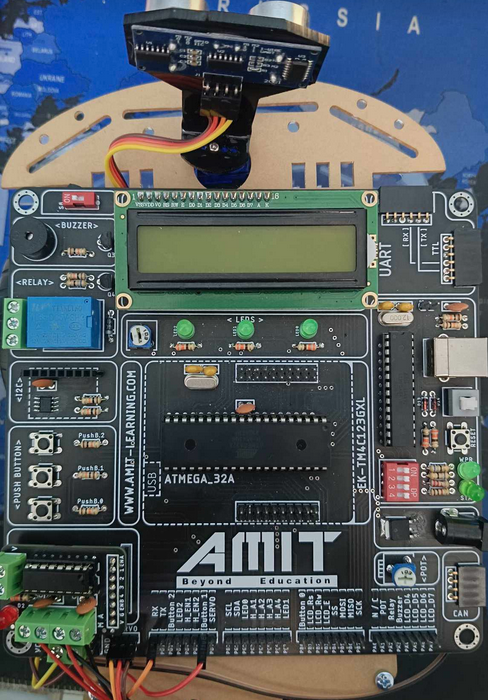
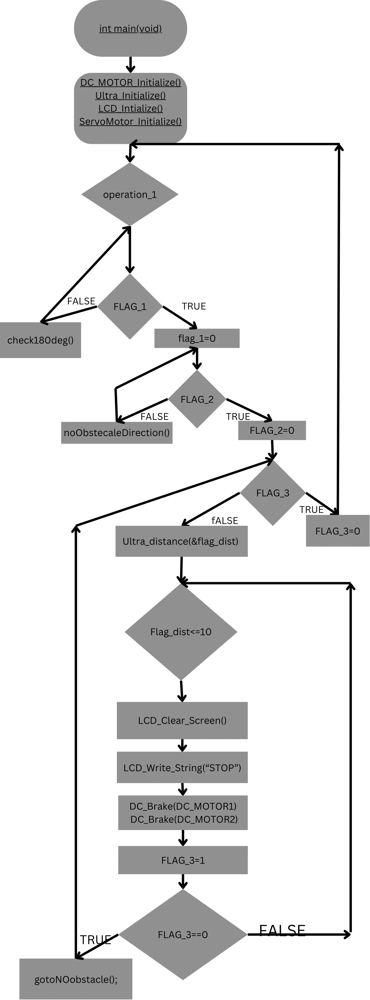
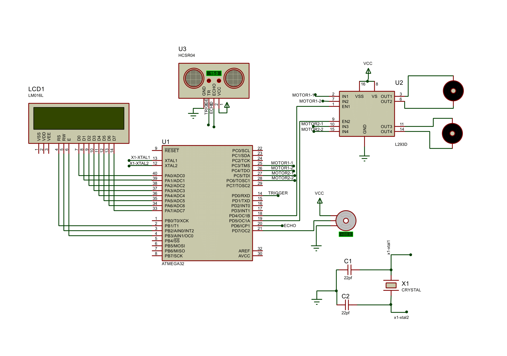

# Atmega32_autonomus_car_project
Autonomous car is used various applications it aims to implement a self-driving Car that can  avoid the obstacles with very fast response by using a ultrasonic sensor to define obstacles on  the way of the car and servo motor to adjust the angle of view of ultrasonic sensor.

# Flow chart

#Proteus simulation

